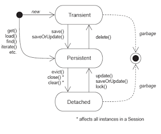

###Escuela Colombiana de Ingeniería
###Construcción de Software - COSW
##Laboratorio - Introducción a JPA - Java Persistence API


###Caso #1. Modelo de Pacientes y Consultas.


1. Abra el proyecto correspondiente al caso. Revise y haga un diagrama (en papel) del modelo de clases que corresponde a las clases suministradas.
2. Agregue las anotaciones que permitan hacer persistencia de Pacientes y sus respectivas consultas. Para esto, tenga en cuenta:
	* Para que una clase se convierta en un 'metadato' para definir su propio esquema de persistencia, debe tener las anotaciones a nivel de clase @Entity y [@Table](https://docs.oracle.com/javaee/5/api/javax/persistence/Table.html), indicando en este último en qué tabla de la base de datos se harán persistentes las instancias.
	* En la clase, cada propiedad primitiva (cadenas, enteros, etc) deberá definir en qué columna de la tabla (definida en la anotación @Table) se insertará. Para hacer esto se usará la anotación [@Column](https://docs.oracle.com/javaee/5/api/javax/persistence/Column.html) en los métodos 'get' de la clase @Entity. Revise el diagrama relacional anterior para identificar qué nombres debe usar en cada caso.
	* Cuando una tabla tiene llaves compuestas, se debe crear una clase con tantas propiedades como elementos de la llave compuesta (en este caso, la clase se llama PacienteId). Dicha clase debe tener la anotación -a nivel de clase- [@Embeddable](https://docs.oracle.com/javaee/5/api/javax/persistence/Embeddable.html), y cada propiedad dentro de la misma debe tener (en sus métodos 'get') la anotación @Column, indicando a qué columna corresponde.
	* Una vez se tiene la clase que representa una llave compuesta de una tabla, la clase asociada a dicha tabla (en este caso Paciente) la debe tener como atributo, y con la anotación @EmbeddedId:

		```java
	    @EmbeddedId
   		 public PacientesId getId() {
	        return this.id;
    	 }
	```	
	
	* Cuando una entidad tiene una realación con otra entidad, a la misma se le debe agregar la anotación @OneToMany o @ManyToOne, según corresponda. En este caso, como la relación se da de uno a muchos (de forma unidireccional) entre Paciente y Consulta, en la entidad Paciente se debe agregar la anotación @OneToMany en el método 'get' correspondiente.
	* En caso de que las tablas no tengan nombres que sigan la convención de JPA, es necesario agregar más detalles a las relaciones @OneToMany y @ManyToOne. En este caso, es necesario indicar a través de qué columnas se harán los JOIN mediante la anotación [@JoinColumns](https://docs.oracle.com/javaee/6/api/javax/persistence/JoinColumns.html). Como se observa en la documentación, @JoinColumns define varios [@JoinColumn](https://docs.oracle.com/javaee/6/api/javax/persistence/JoinColumn.html), uno para cada columna de la tabla con la que se haga el JOIN para relacionar a las dos entidades. En este caso, es necesario que a cada anotación @JoinColumn agregue la propiedad *nullable=false* (de lo contrario, se permitiría crear una sentencia SQL que no inserte las llaves foráneas):

		```java
		@JoinColumn(name="...", referencedColumnName="...", nullable=false)
	```

3. Para que las clases anteriormente anotadas sean tenidas en cuenta como 'metadatos' para el mapeo objetos-relacional, agregue cada una de las clases @Entity (no incluya las clases @Embeddable) al archivo de configuración de hibernate (hibernate.cfg.xml) como un elemento _mapping_  dentro de _sessionfactory_. Por ejemplo:

	```xml
	<session-factory>
		...
		<mapping class="edu.eci.cosw.ejemplo.EntidadABC"/>
		...
	<session-factory>
	```

4. En el programa base suministrado (SimpleMainApp), a través de la sesión creada consulte el Paciente cuyo identificador es: id: 1, tipoid: "cc". Para esto, use el método [load](https://docs.jboss.org/hibernate/orm/4.3/javadocs/org/hibernate/Session.html#load(java.lang.Class,%20java.io.Serializable)) de la clase Session. Haga que el programa imprima por pantalla el resumen de cada una de las consultas.

5. Modifique el programa anterior para que al paciente consultado se le agregue una nueva consulta que tenga su nombre en la descripción. Actualice el paciente mediante el método [saveOrUpdate](https://docs.jboss.org/hibernate/orm/4.3/javadocs/org/hibernate/Session.html#saveOrUpdate(java.lang.Object) del objeto Session. Qué error se produce?. Teniendo en cuenta el siguiente diagrama, identifique la causa del problema:

	

6. Revise en la documentación de [@OneToMany](https://docs.oracle.com/javaee/6/api/javax/persistence/OneToMany.html) sobre cómo hacer que las operaciones de persistencia se realicen en cascada a las entidades con las que se tenga relación. Aplíquelo al ejemplo anterior y verifique los resultados.
7. Rectifique que en la base de datos haya quedado el registro de la consulta asociada al paciente 1 (para esto, use un cliente SQL).


###Caso #2. Modelo de Pacientes y Consultas.


1. Abra el proyecto correspondiente al caso. Revise y haga un diagrama (en papel) del modelo de clases que corresponde a las clases suministradas.
2. Realice el mismo procedimiento anterior, esta vez teniendo también en cuenta que:
	* En esta caso hay dos entidades con llaves compuestas.
	* Las relaciones son unidireccionales, de tipo @ManyToOne, entre PolizaAprobada y Cliente/TipoPoliza (no olvide agregar la anotación @JoinColumn / @JoinColumns con sus respectivos detalles, si la relación entre el 'Many' y el 'One' se da con una o con varias columnas, respectivamente).
3. Haga un programa que cree un nuevo cliente (con su nombre), y cree para éste una nueva 'póliza aprobada' asociada a la póliza #1.


###Caso #3. Modelo de Estudiantes y cursos (bidireccional).


1. Abra el proyecto correspondiente al caso. Revise y haga un diagrama (en papel) del modelo de clases que corresponde a las clases suministradas.
2. Realice el mismo procedimiento anterior, esta vez teniendo también en cuenta que:
	* En esta caso va a implementar una relación bidireccional, de tipo @ManyToMany entre Estudiante y Curso. Revise el ejemplo #3 de la documentación de [@ManyToMany](https://docs.oracle.com/javaee/6/api/javax/persistence/ManyToMany.html) para ver cómo se hace uso de la anotación @JoinTable. En el caso de @ManyToMany, es neceario, en lugar de definir cuales son las 'columnas de JOIN' (@JoinColumn/@JoinColumns), definir cual es la 'tabla de JOIN' (@JoinTable).
