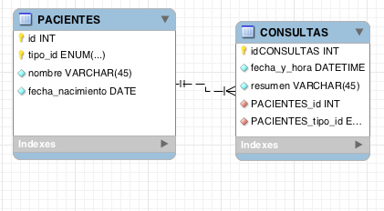
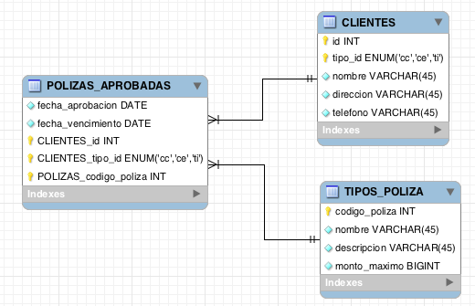

###Escuela Colombiana de Ingeniería
###Construcción de Software - COSW
###Laboratorio - Introducción a JPA - Java Persistence API

####Caso #1. Modelo de Pacientes y Consultas.

1. Abra el proyecto correspondiente al caso. Revise y haga un diagrama (en papel) del modelo de clases que corresponde a las clases suministradas.
2. Agregue las anotaciones que permitan hacer persistencia de Pacientes y sus respectivas consultas. Para esto, tenga en cuenta:
	* Para que una clase se convierta en un 'metadato' para definir su propio esquema de persistencia, debe tener las anotaciones a nivel de clase @Entity y [@Table](https://docs.oracle.com/javaee/5/api/javax/persistence/Table.html), indicando en este último en qué tabla de la base de datos se harán persistentes las instancias.
	* En la clase, cada propiedad primitiva (cadenas, enteros, etc) deberá definir en qué columna de la tabla (definida en la anotación @Table) se insertará. Para hacer esto se usará la anotación [@Column](https://docs.oracle.com/javaee/5/api/javax/persistence/Column.html) en los métodos 'get' de la clase @Entity. Revise el diagrama relacional anterior para identificar qué nombres debe usar en cada caso.
	* Cuando una tabla tiene llaves compuestas, se debe crear una clase con tantas propiedades como elementos de la llave compuesta (en este caso, la clase se llama PacienteId). Dicha clase debe tener la anotación -a nivel de clase- [@Embeddable](https://docs.oracle.com/javaee/5/api/javax/persistence/Embeddable.html), y cada propiedad dentro de la misma debe tener (en sus métodos 'get') la anotación @Column, indicando a qué columna corresponde.
	* Cuando una entidad tiene una realación con otra entidad, a la misma se le debe agregar la anotación @OneToMany o @ManyToOne, según corresponda. En este caso, como la relación se da de uno a muchos (de forma unidireccional) entre Paciente y Consulta, en la entidad Paciente se debe agregar la anotación @OneToMany en el método 'get' correspondiente.
	* En caso de que las tablas no tengan nombres que sigan la convención de JPA, es necesario agregar más detalles a las relaciones @OneToMany y @ManyToOne

[@JoinColumns](https://docs.oracle.com/javaee/6/api/javax/persistence/JoinColumns.html)

https://docs.oracle.com/javaee/6/api/javax/persistence/Column.html

####Caso #2. Modelo de Pacientes y Consultas.

